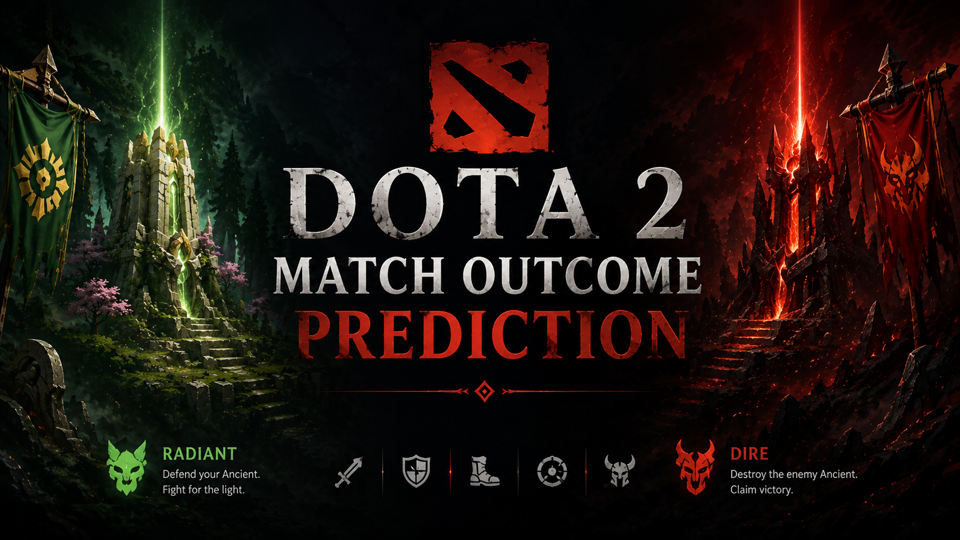
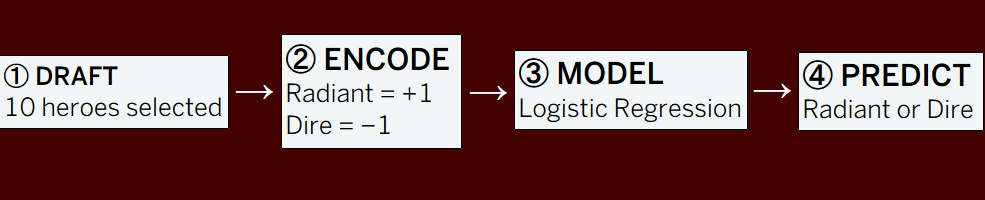
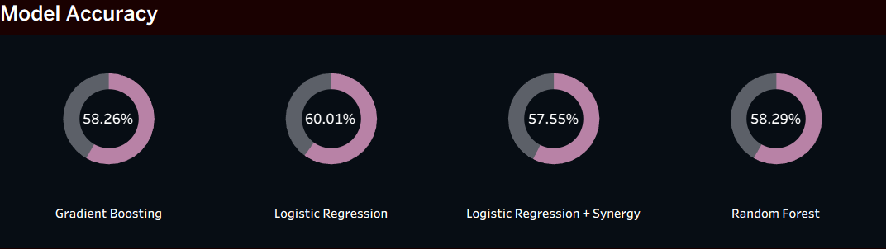
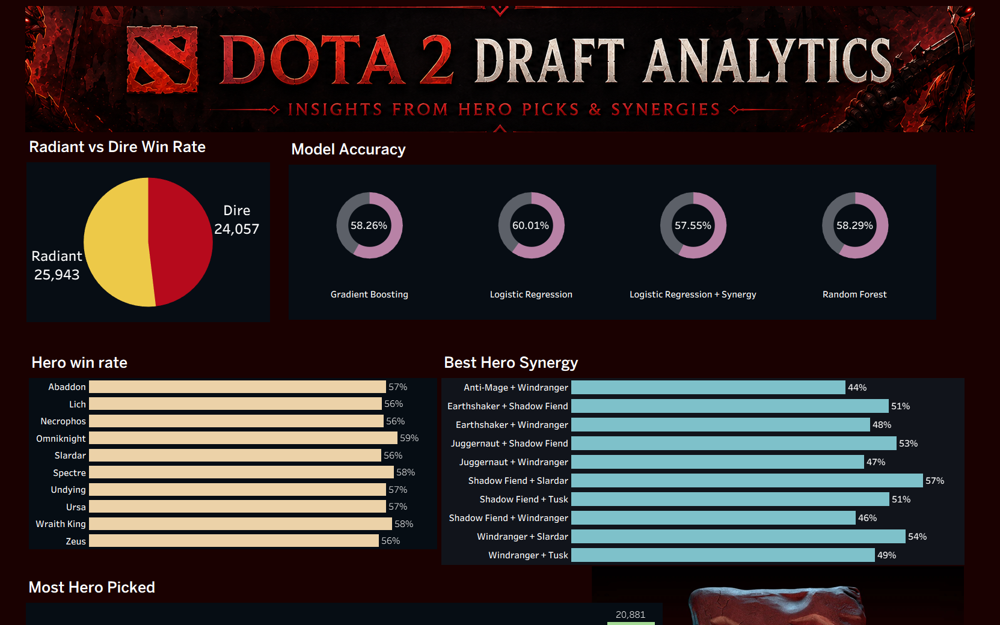
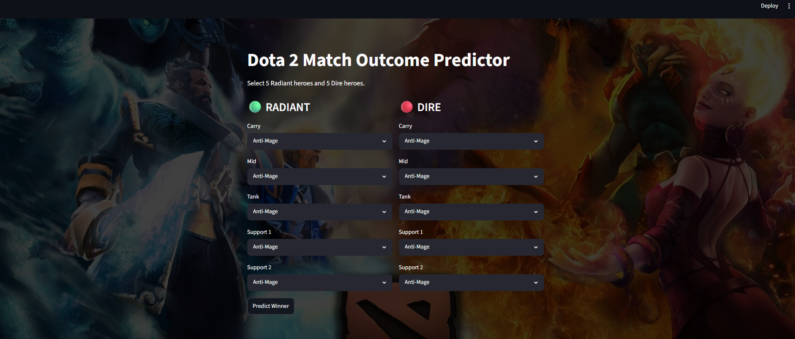

<p align="center">
  
</p>

<p align="center">
  
  
  
  
  
</p>

# Dota 2 Match Outcome Prediction

A machine-learning project that predicts the winner of a **Dota 2 match using only the hero draft**.

The central question was simple:

> **Can we predict who will win before the match even starts?**

The project combines **data cleaning, exploratory analysis, hero synergy analysis, machine learning, Tableau storytelling, and an interactive Streamlit application**.

---

## Project Workflow

<p align="center">
  
</p>

---

## Dataset

The project uses the **Dota 2 Matches** dataset from Kaggle:

**Dota 2 Matches — Devin Anzelmo**  
https://www.kaggle.com/datasets/devinanzelmo/dota-2-matches

Main source files used:

- `matches.csv`
- `players.csv`
- `heroes.csv`

The original dataset is very large, so the raw files are **not included** in this repository.

---

## Objective

Each match contains two teams:

### Radiant
- Carry
- Mid
- Tank
- Support 1
- Support 2

### Dire
- Carry
- Mid
- Tank
- Support 1
- Support 2

The model receives the **10 selected heroes** and predicts whether **Radiant or Dire is more likely to win**.

No in-game statistics are used.

That means the model does **not** see kills, gold, items, towers, match duration, or any other information that happens after the game begins.

---

## Data Preparation

The original player-level dataset contains one row per player.

Each match was reconstructed into a draft format:

```text
match_id
Radiant_1
Radiant_2
Radiant_3
Radiant_4
Radiant_5
Dire_1
Dire_2
Dire_3
Dire_4
Dire_5
radiant_win
```

Player slots were used to determine whether each hero belonged to **Radiant** or **Dire**.

---

## Hero Encoding

Each hero was converted into its own feature.

```text
+1 = Hero selected by Radiant
-1 = Hero selected by Dire
 0 = Hero not selected
```

Example:

```text
                Juggernaut   Pudge   Crystal Maiden
Match 1              1        -1          0
Match 2              0         1         -1
```

This allows the model to understand both:

- which heroes were selected
- which side selected them

---

## Machine Learning

Four model configurations were compared:

| Model | Accuracy |
|---|---:|
| Random Forest | 58.29% |
| Logistic Regression | 59.82% |
| Gradient Boosting | 58.26% |
| **Tuned Logistic Regression** | **60.01%** |

<p align="center">
  
</p>

### Best Model

The best-performing model was **Logistic Regression after hyperparameter tuning**, reaching approximately **60% accuracy**.

That result is meaningful because the model uses **only the draft**.

Dota 2 outcomes are also influenced by:

- Player skill
- Team coordination
- Lane execution
- Item builds
- Objectives
- Mechanical mistakes
- Patch/meta changes

So the draft alone still contains a measurable predictive signal.

---

## Hero Analysis

### Radiant vs Dire Win Rate

The overall Radiant and Dire win rates were compared to check whether one side showed an inherent advantage in the historical dataset.

### Most Picked Heroes

Hero pick frequency was analyzed to identify the most popular heroes.

### Hero Win Rate

Hero win rates were calculated while filtering out heroes with very low match counts.

This prevents misleading cases such as:

> 1 game played → 1 win → **100% win rate**

### Hero Synergy

Hero pairs were analyzed to identify combinations that tend to perform well together.

A five-hero team contains:

```text
10 unique hero pairs
```

Synergy was calculated separately for Radiant and Dire.

Pairs with very few games were filtered to make the analysis more reliable.

---

## Tableau Dashboard

The Tableau story presents the project in a visual sequence:

1. Radiant vs Dire Win Rate
2. Most Picked Heroes
3. Hero Win Rate
4. Best Hero Synergies
5. Model Accuracy
6. Final Summary


<p align="center">
  
</p>
```

---

## Streamlit Prediction App

The Streamlit application turns the trained model into an interactive draft predictor.

The user selects:

```text
5 Radiant heroes
+
5 Dire heroes
```

The app then:

1. Validates the selected draft
2. Applies the same hero encoding used during training
3. Loads the trained model
4. Generates a prediction
5. Displays the predicted winner


<p align="center">
  
</p>
```

---

## Running the App

Install the required packages:

```bash
pip install -r requirements.txt
```

Then run:

```bash
streamlit run app.py
```

The application will open in your browser.

---

## Technology Stack

| Area | Tools |
|---|---|
| Data Processing | Python, Pandas, NumPy |
| Machine Learning | Scikit-learn |
| Analysis | Jupyter Notebook |
| Visualization | Tableau |
| Deployment | Streamlit |
| Version Control | Git, GitHub |

---

## Key Findings

- Draft composition contains enough information to predict match outcomes **better than random guessing**.
- Logistic Regression performed slightly better than the other tested models.
- Hyperparameter tuning produced the best result at approximately **60.01% accuracy**.
- Popular heroes are not necessarily the heroes with the highest win rates.
- Some hero combinations show noticeably stronger synergy.
- Filtering by match count is essential when interpreting hero win rates and pair synergy.

---

## Limitations

The model does not include:

- Player MMR
- Player-specific hero experience
- Actual lane assignments
- Items
- Gold
- Kills / deaths / assists
- Objectives
- Team communication
- Patch-specific meta information

Dota 2 changes continuously, so historical relationships between heroes may not perfectly represent the current patch.

---

## Future Improvements

Potential extensions include:

- Using newer match data
- Adding player MMR
- Adding hero-role information
- Including lane matchups
- Using historical hero-vs-hero matchup statistics
- Testing XGBoost or neural-network models
- Retraining the model for new Dota 2 patches
- Displaying richer prediction probabilities in the Streamlit app


---

## Author

**Saurabh Diwakar**  
Ironhack Data Analytics Final Project
